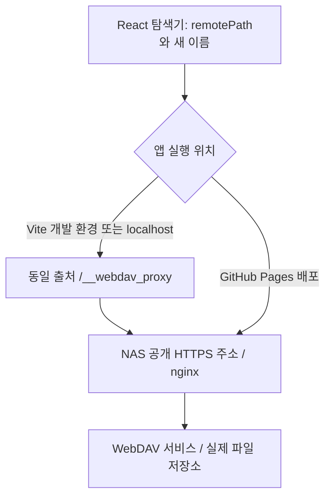

# WebDAV 이름 변경·이동 구조 점검

점검: 2026-08-31 19:24~19:27 KST. 코드, 현재 로컬 제공 소스, 공개 배포 JS, NAS OPTIONS 응답을 확인했다. NAS 파일에 대한 실제 PUT/MOVE/COPY/DELETE는 실행하지 않았다. 인증 정보와 NAS 설정 파일은 조회하지 않았다.

## 결론

파일명 자체의 제약만으로 설명할 문제가 아니다. 브라우저 요청을 중계하는 경로와 서버가 허용하는 WebDAV 요청 조건이 일치하지 않는다. 확정한 결함은 NAS 직접 연결에서 조건부 PUT의 CORS 사전 허용 실패다. 기존 MOVE/COPY 400의 내부 원인은 아직 확정하지 못했다.

앞선 GET→PUT 대체 저장 수정은 로컬 HTTP 테스트에는 통과했지만, 실제 NAS CORS 조건을 검사하지 못했다. 따라서 그 테스트를 실제 NAS 이름 변경 성공으로 해석하면 안 된다.

## 현재 구조



- `src/App.jsx:29`: 개발 환경/localhost와 허용된 NAS 호스트 조합에서만 프록시를 선택한다. 배포본은 입력된 서버 URL에 직접 연결한다.
- `vite.config.js:8`: 프록시 목적지는 `https://webdav.freemath.synology.me`로 고정되어 있다. 사용자가 입력한 프로토콜이나 포트를 그대로 중계하는 범용 프록시가 아니다.
- `vite.config.js:50`: 로컬 프록시 주소가 들어간 Destination을 공개 NAS 주소로 바꾼다. NAS 앞 nginx에서 내부 WebDAV 서비스 주소로 변환하는지는 이 저장소로 확인할 수 없다.
- `.github/workflows/deploy.yml`: dist 정적 파일만 GitHub Pages로 배포한다. Vite 프록시 코드는 이 배포물에서 서버로 실행되지 않는다.
- NAS 응답의 `Server: nginx`는 확인했다. 그 뒤 실제 포트·프로토콜·WebDAV 구현·공유폴더 매핑은 확인하지 못했다.

WebDAV에서 이름 변경은 같은 폴더 안의 다른 경로로 이동하는 작업이다. 파일 내용이 보인다는 것은 목록/읽기 경로가 동작한다는 뜻이지 쓰기·복사·삭제 권한이나 요청 전달의 성공을 보장하지 않는다.

## 실제 관측

NAS 루트에 인증 없는 OPTIONS를 보냈다. 파일 쓰기 없이 브라우저의 사전 허용 조건만 검사한 결과다. Origin은 `https://shoutjoy.github.io`이며 주요 PUT 비교는 `http://localhost:5173`에서도 동일했다.

| 요청할 작업 | Access-Control-Request-Headers | 상태 | 허용 응답 |
|---|---|---|---|
| PROPFIND | authorization,depth | 204 | Origin/Method/Headers 모두 있음 |
| MOVE | authorization,destination,overwrite | 204 | 모두 있음 |
| COPY | authorization,depth,destination,overwrite | 204 | 모두 있음 |
| PUT | authorization,content-type | 204 | 모두 있음 |
| PUT | authorization,content-type,if-none-match | 204 | Origin/Method/Headers 모두 없음 |
| PUT | authorization,content-type,if-match | 204 | 모두 없음 |
| DELETE | authorization | 204 | 모두 있음 |
| MKCOL | authorization | 204 | 모두 있음 |

204라는 상태만으로 CORS 통과가 아니다. 요청한 메서드·헤더와 출처를 허용하는 응답 헤더가 있어야 한다.

특이점: COPY의 헤더를 `authorization,destination,overwrite,depth` 순서로 보냈을 때는 허용 헤더가 없고, 브라우저에서 사용하는 정렬 순서인 `authorization,depth,destination,overwrite`에서는 허용했다. 현재 서버의 처리에 헤더 순서 의존성이 관측된다. 정확한 설정 원인은 서버 설정을 열어 확인해야 하며, COPY 자체가 CORS로 항상 차단된다고 판단해서는 안 된다.

추가 관측:

- `http://localhost:5173/` 응답 200.
- 해당 서버의 `/src/App.jsx`, `/src/webdavMoveEngine.js`에서 현재 프록시 선택과 대체 저장 코드를 확인했다. 5174도 실행 중이며 같은 관련 코드가 제공된다.
- `http://localhost:5173/__webdav_proxy/`에 PROPFIND를 보내면 NAS의 401 응답이 돌아온다. 프록시→NAS 통신은 되지만 인증/쓰기 권한을 증명하지는 않는다.
- 공개 배포 페이지의 JS는 `index-DSOwVCTZ.js`. 그 안에 앞선 `새 이름으로 파일 저장` 대체 처리와 `If-None-Match` SDK 코드가 포함되어 있다. 공개 배포에 수정이 아예 없다는 가설은 해당 시점의 배포물에 대해서 배제한다. 사용자가 연 탭의 캐시 버전까지 확인한 것은 아니다.

## 이번 오류가 발생하는 경로

`src/App.jsx:358`의 이름 변경은 MOVE를 먼저 시도한다. 실패하면 `src/webdavMoveEngine.js`로 넘어가 COPY를 시도하며, 일부 오류는 GET→PUT으로 대체한다.

```text
MOVE 실패
  → COPY 실패
    → 원본 GET
      → 새 이름 PUT (overwrite: false)
        → SDK가 If-None-Match: * 추가
          → NAS 직접 연결일 때 OPTIONS에서 허용 응답 누락
            → 브라우저 Failed to fetch
```

`If-None-Match: *`는 이미 존재하는 파일을 덮어쓰지 않기 위한 조건이다. SDK는 `overwrite: false`에서 자동으로 붙인다. 이를 없애거나 overwrite를 true로 바꾸면 화면 오류는 달라질 수 있지만 기존 파일을 덮어쓸 위험이 생기므로 해결책으로 삼으면 안 된다.

이 조건부 PUT 차단은 실제 응답으로 확인했다. 다만 스크린샷에는 앱 주소와 Network 기록이 없으므로 사용자의 해당 요청이 직접 연결인지 로컬 프록시인지까지 확정할 수 없다. 로컬 프록시를 사용한 요청이면 같은 출처이므로 이 CORS 설명은 직접 적용되지 않으며 프록시 로그/연결 종료/시간 제한을 별도 확인해야 한다.

기존 400은 HTTP 오류이며 `Failed to fetch`와 구분해야 한다. MOVE/COPY는 Destination 헤더를 사용한다. 공개 HTTPS 주소와 nginx 뒤 내부 주소의 호스트·프로토콜·포트 차이, 경로 매핑, NAS 제약 등이 조사 대상이다. CORS 사전 허용 성공은 실제 MOVE/COPY 성공이나 권한을 보장하지 않는다.

## 동작시키기 위한 우선순위

### 1. 운영 요청 경로를 통일

권장 구조는 앱과 동일 출처의 신뢰할 수 있는 서버 프록시를 사용하는 것이다. NAS에서 앱과 `/webdav/` 경로를 함께 제공하거나, 앱을 운영 백엔드와 함께 호스팅하고 NAS를 중계한다. 로컬과 운영에서 동일한 클라이언트 경로를 사용하도록 구성한다.

프록시는 임의 URL을 받는 공개 프록시로 만들지 않는다. NAS 호스트/경로와 메서드를 제한하고 인증을 전달하되 비밀번호를 로그에 남기지 않아야 한다. 인증서 검증을 유지하고 실제 호스트와 일치하는 인증서를 사용한다. 기존 개발 설정 `secure: false`를 운영 보안 설계로 그대로 복제하지 않는다.

GitHub Pages를 유지하면서 NAS에 직접 연결하려면 NAS/nginx 쪽 CORS를 고쳐야 한다. 최소한 실제 사용하는 Authorization, Content-Type, Depth, Destination, Overwrite, If-None-Match, If-Match와 WebDAV 메서드를 처리하고, 헤더 순서/대소문자에 의존하지 않도록 한다. 정상 응답뿐 아니라 400/401/403/409/412/423 등 오류 응답에서도 허용된 출처가 오류 내용을 읽을 수 있어야 한다. ETag를 이용할 경우 응답 헤더 노출도 필요하다. 허용 출처는 사용 중인 앱 출처로 제한하는 것이 바람직하다.

### 2. MOVE/COPY의 Destination을 서버에서 일관되게 매핑

브라우저의 논리 파일 경로, 공개 NAS URL, 내부 WebDAV URL을 구분한다. 원본 요청과 Destination이 동일한 파일 저장소를 가리키도록 서버에서 함께 변환한다. 한글/공백/#/%의 인코딩은 URL 작성 시 한 번만 적용하고, root 접속과 하위 폴더를 base URL로 사용하는 경우를 구분해 검사한다.

400의 정확한 원인은 nginx/WebDAV 로그에서 실제 요청과 응답 본문을 비교해야 한다. 임의로 `https`를 `http`로 치환하는 식으로 해결하지 않는다.

### 3. 작업 안전성을 이름 변경과 이동에 공통 적용

- 현재 폴더 이동은 파일 하나씩 복사 확인 직후 원본을 삭제한다. 도중에 실패하면 원본과 목적지에 나뉜 상태가 된다. 전체 폴더 복사·검증 후 삭제 단계로 넘어가고, 작업 기록으로 재개/복구할 수 있게 한다.
- COPY 응답 소실과 PUT 응답 소실을 구분해 재조회한다. PUT의 Failed to fetch도 서버가 저장하지 않았다는 증거는 아니다. 현재 PUT 오류에서는 재검증 없이 중단한다.
- ETag/If-Match 등을 이용해 복사 중 원본이 변경된 경우 삭제하지 않도록 한다. 기존 목적지와 자기 자신을 확실히 구분하고 충돌을 명시적으로 처리한다.
- 권한(403), 잠금(423), 충돌(409/412)을 요청 형식 미지원과 분리한다. 현재 MOVE fallback 범위는 403/409/423도 포함한다.
- 폴더 이름 변경 시 현재 열린 하위 파일의 경로도 새 prefix로 갱신해야 한다. `handleConfirmRename`은 정확히 같은 경로의 선택 파일만 갱신하고, 일반 이동 쪽의 하위 경로 처리와 일치하지 않는다.
- 파일명 입력에서 경로 구분자와 `.`/`..` 등을 거부하고, 미저장 편집 상태와 작업 이력 기반 Undo/Redo를 공통 처리한다. 현재 rename 경로에는 원격 작업 이력 기반 Undo/Redo가 없다.
- 개발 프록시 제한은 15초다. 대용량 작업에서는 서버에서 작업을 진행하고 진행 상태를 조회하는 구조가 브라우저 전체 파일 버퍼링보다 적합하다.

## 다음 검증의 합격 조건

1. 실제 사용 중인 앱 주소와 Network의 Request URL로 직접 연결/프록시를 확정한다.
2. 원본 오류의 메서드·상태·응답 본문·Destination과 NAS/nginx 로그를 맞춘다. Authorization 값은 기록하지 않는다.
3. 테스트 전용 파일로 한글 이름 변경, 하위 폴더 이동, 동일 이름 충돌, 잠긴 파일, 쓰기 금지 폴더를 시험한다.
4. 업로드/복사 후 응답 소실, 중간 실패, 재시도를 시험하고 원본/목적지 상태와 복구 동작을 검증한다.
5. 새로고침 후 파일 위치/내용, 열린 편집기의 저장 경로, Undo/Redo까지 확인한다.

이번 점검은 코드나 NAS 설정을 변경하는 작업이 아니라 구조·통신 진단이다. 로그인된 실제 쓰기 검증 전에는 이름 변경/이동 해결 완료로 판정하지 않는다.

참고: https://developer.mozilla.org/en-US/docs/Web/HTTP/Guides/CORS , https://www.rfc-editor.org/rfc/rfc4918.html
