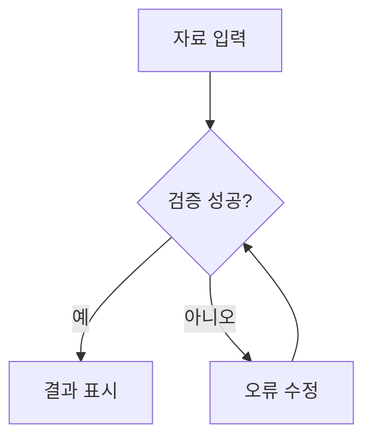

# AI JENA Mermaid 빠른 오류 방지 규칙

대상: 호스트 앱이 지원하는 Mermaid 문법. WebDAV MDPRO의 기본 로더는 11.14.0을 우선 사용하며, CDN 실패 시 11 계열 대체 소스를 사용한다. 검증은 별도 버전이 아니라 실제 호스트 엔진으로 수행한다.

## 생성 참고자료

- 노드 ID는 N1, N2처럼 영문과 숫자로 단순하게 작성한다.
- 순서도 라벨은 큰따옴표로 감싼다. 내부 큰따옴표는 `#quot;`로 표현한다.
- 노드 선언과 연결 선언은 각각 별도 줄에 둔다.
- `end`를 노드 ID로 사용하지 않는다. 모든 subgraph와 코드 펜스를 닫는다.
- 기본 도형을 우선한다. 요청하지 않은 HTML, 아이콘, 클릭 동작, 테마 설정은 추가하지 않는다.
- 코드 블록은 `mermaid` 언어를 지정하고 완결된 다이어그램으로 반환한다.
- 호스트의 밝은/어두운 테마를 존중하고, 사용자 지정 색상을 요청받았다면 글자 대비를 확보한다.
- 오류 수정은 노드의 의미와 연결 관계를 유지한다.

## 속도 정책

일반 답변에는 엔진 로딩이나 추가 AI 요청을 하지 않는다. Mermaid만 로컬 `parse()`로 검사한다. 성공한 소스는 엔진별 최대 40개 캐시한다. 문법 오류가 있을 때만 실패한 코드와 오류 메시지를 묶어 동일 공급자/모델에 최대 한 번 수정 요청한다. 검색과 대화 전체 재전송을 하지 않는다. 다시 실패하면 원문과 안내를 남기고 삽입을 보류한다.

속도를 위해 사전 SVG 시험 렌더링은 중복 실행하지 않는다. 문법 검증은 배치, 글꼴, 렌더링 성공, 사실관계나 의미의 정확성을 보장하지 않는다. 실제 미리보기 확인이 필요하다. 최초 사용 시 CDN 로딩 비용과 오류 수정 시 추가 API 비용/시간은 발생할 수 있다.

공식 참고: [Flowchart](https://mermaid.js.org/syntax/flowchart.html), [Mermaid API](https://mermaid.js.org/config/usage.html#api-usage).
